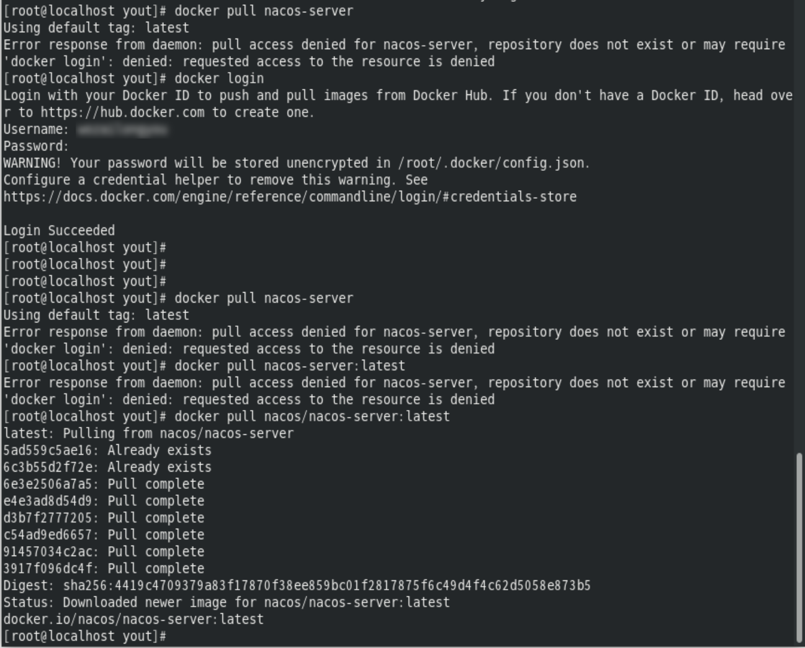
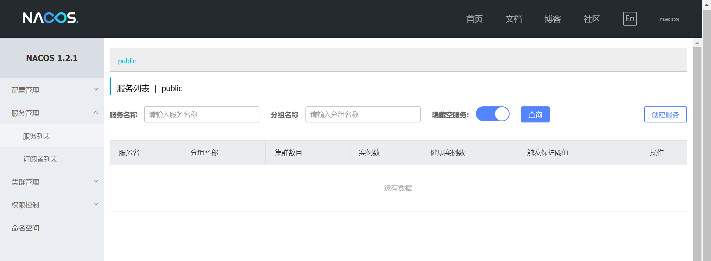
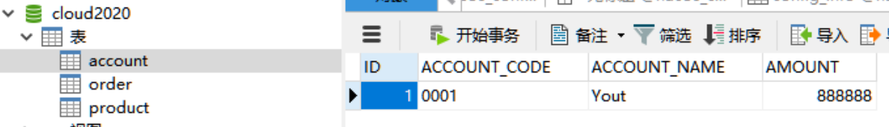
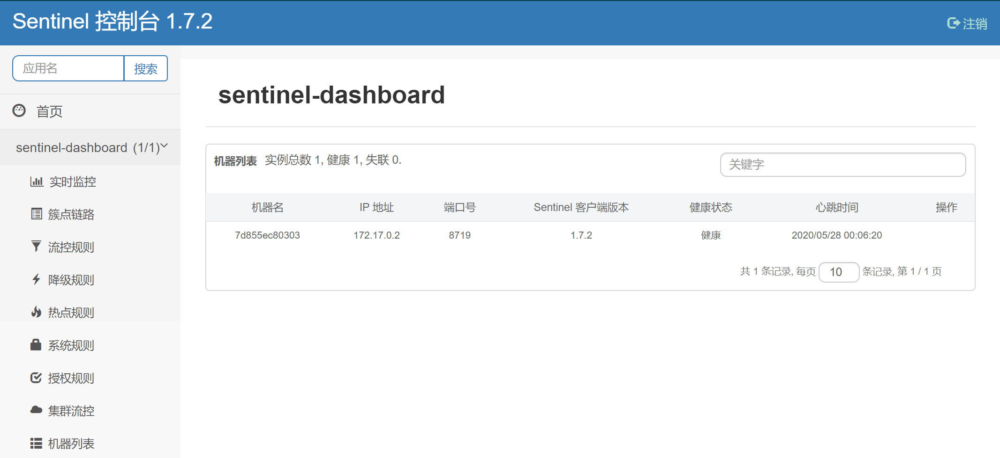
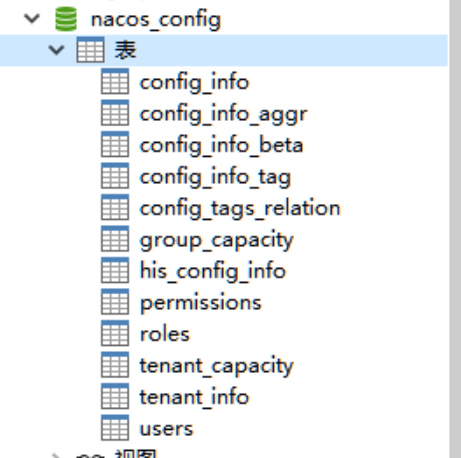
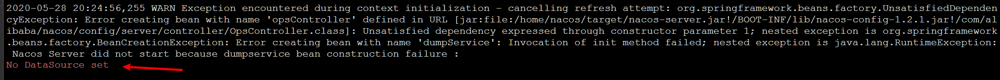
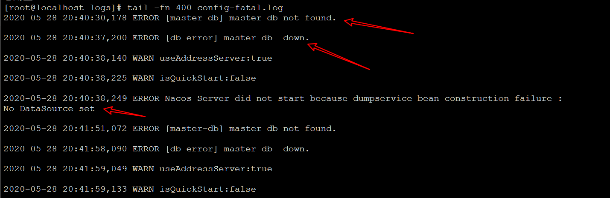
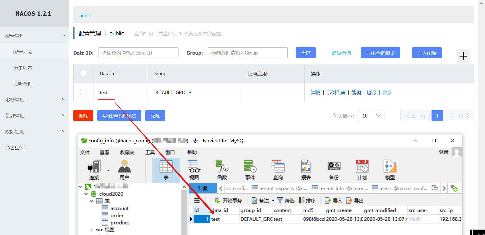
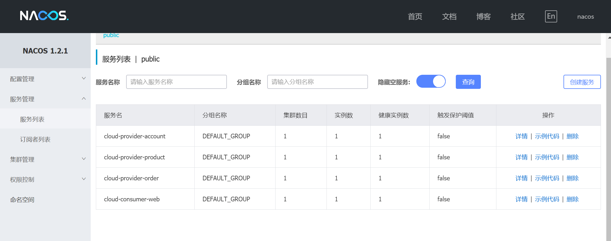

# Spring Cloud Memo

## 1.  技术栈

| 需求               | 推荐技术         | 其他                                |
| ------------------ | ---------------- | ----------------------------------- |
| 服务注册与发现     | Alibaba Nacos    | Eureka，Zookeeper，Consul           |
| 服务调用           | OpenFeign(Feign) | LoadBalancer，                      |
| 负载均衡           | Ribbon           | LoadBalance                         |
| 服务降级           | Alibaba Sentinel | Hystrix，Resilience4j(国外用的较多) |
| 服务网关           | Gateway          | Zuul，Zuul2                         |
| 服务配置           | Alibaba Nacos    | Config                              |
| 服务总线           | Alibaba Nacos    | Bus                                 |
| 分布式事务         | Alibaba Senta    |                                     |
| 消息驱动           | Stream           |                                     |
| 分布式请求链路跟踪 | Sleuth           |                                     |
| 消息               | ActiveMQ         | RabbitMQ，Kafka                     |

## 2. 业务描述

本Demo模拟简单业务场景：用户下单。主要基于三个微服务：用户服务`AccountService`，订单服务`OrderService`，产品服务`ProductService`。

## 3. 环境准备

```shell
#小技巧：在使用docker配置环境的时候，经常会遇到下载镜像很慢的问题，可以通过配置阿里云的镜像加速器来加速下载，原理就是由阿里云机器先下载好，我们再到阿里云的服务器上下载。
#首先注册阿里云账号，再访问：https://cr.console.aliyun.com/cn-hangzhou/instances/mirrors
#操作方法以CentOS为例：
sudo mkdir -p /etc/docker
sudo tee /etc/docker/daemon.json <<-'EOF'
{
  "registry-mirrors": ["https://这里是自动生成的一个ID.mirror.aliyuncs.com"]
}
EOF
sudo systemctl daemon-reload
sudo systemctl restart docker
# 重启docker后下载常见的镜像速度很快了。
```


### Nacos

1. 使用Nacos安装包启动Nacos。（略）

2. **使用Docker启动Nacos。**

   - 下载Nacos-server镜像。

     ```
     docker pull nacos/nacos-server:latest
     ```

注意：通过`docker pull`命令下载的时候要注意，需要加上Nacos的全路径，否则下载不成功，如图：

  

- 启动Nacos（单机版）。
  
     ```shell
     ## --rm 是为了在结束容器的时候方便删除;(Automatically remove the container when it exits)
     ## --name 给容器取个别名容易识别
     ## -p 设置容器和主机的端口映射(container:host)
     ## -d 在后台运行并打出容器ID；(Run container in background and print container ID)
     docker run --rm --name nacos-standalone -e MODE=standalone -p 8848:8848 -d nacos/nacos-server:latest
     ```
     
     

### Mysql

1. 启动mysql容器。

   ```shell
   ## 使用默认配置
   docker run --name mysql -e MYSQL_ROOT_PASSWORD=root账号的密码 -p 3306:3306 -d mysql
   ## 使用自己的配置，可以写在宿主机器目录下，使用 -v 参数
   docker run --rm --name mysql -v /my/custom:/etc/mysql/conf.d -e MYSQL_ROOT_PASSWORD=12345 -p 3306:3306 -d mysql
   ```

2. 可以使用adminer来进行网页端的数据库管理

   ```shell
   docker run --name adminer -p 8080:8080 -d adminer
   ```

   启动后就可以通过`http://ip:8080`来进行访问。

3. 这样配置可以使用数据库，但是遇到个问题每次重新弄启动容器，数据就不见了又要重新配置，所以要将容器内的数据持久化到宿主机器上来。

   ```shell
   mkdir /myDockerDatas
   mkdir /myDockerDatas/mysql
   docker run --name mysql -d -v /myDockerDatas/mysql:/var/lib/mysql -p 3306:3306 -e MYSQL_ROOT_PASSWORD=123456 mysql
   ```

4. 在连接数据库的时候由于是新版的mysql 8.0所以默认加密方式是`caching_sha2_password`很多客户端连不上，可以通过修改加密方式来解决。

   ```sql
   -- 这里用%是保证其他IP能够连上，否则只有本地才能连接。
   ALTER USER 'root'@'%' IDENTIFIED BY '123456' PASSWORD EXPIRE NEVER;
   ALTER USER 'root'@'%' IDENTIFIED WITH mysql_native_password BY '123456';
   FLUSH PRIVILEGES; --刷新权限
   ```
   
5. 创建业务表。

   

### Sentinel

1. 下载镜像并运行。

   ```shell
   ## 默认下载最新版本，注意加上全路径。
   docker pull bladex/sentinel-dashboard
   ## 启动
   docker run --name sentinel  -d -p 8858:8858  bladex/sentinel-dashboard
	```

2. 访问Sentinel操作界面。

   ```shell
   http://yout-ip:8858/
	```

   

## 3. 用mysql持久化Nacos配置

	Nacos通过内部自带的数据库*derby*，查看不方便而且有容量限制，我们需要配置到mysql中进行持久化。mysql建表语句在GitHub上，连接如下。（首先手动创建数据库：nacos_config）

```url
https://github.com/alibaba/nacos/blob/develop/distribution/conf/nacos-mysql.sql
```



## 5. 通过Docker Compose来一次性配置多个镜像

如果每次调试代码都需要每个容器启动一起各种参数，非常麻烦，这个时候就需要用到`docker-compose`来解决，实现一次配置，一次执行，环境就ready了。

1. docker-compose的安装

   ```shell
   # 如果是低版本的python可以用pip命令。
   pip3 install docker-compose
   # 验证是否安装成功
   docker-compose -v
   ```


2. 写yaml文件。

   ```yaml
   version: "2"
   services:
     nacos:
       image: nacos/nacos-server:latest
       container_name: nacos
       env_file:
         - /myDockerDatas/env/nacos-standlone-mysql.env
       volumes:
         - /myDockerDatas/plugins/mysql/:/home/nacos/plugins/mysql/
         - /myDockerDatas/nacos/logs/:/home/nacos/logs
         - /myDockerDatas/nacos/custom.properties:/home/nacos/init.d/custom.properties
       ports:
         - "8848:8848"
         - "9555:9555"
       depends_on:
         - mysql
       restart: on-failure
   
     mysql:
       container_name: mysql
       image: mysql
       env_file:
         - /myDockerDatas/env/mysql.env
       volumes:
         - /myDockerDatas/mysql:/var/lib/mysql
       ports:
         - "3306:3306"
   
     sentinel:
       image: bladex/sentinel-dashboard:latest
       container_name: sentinel
       ports:
         - "8858:8858"
       restart: always
   ```

   我将其保存到宿主机器`/myDockerDatas/docker-compose-yml/cloud2020.yml`文件中。

   - `nacos-standlone-mysql.env`

   ```env
   EFER_HOST_MODE=hostname
   MODE=standalone
   SPRING_DATASOURCE_PLATFORM=mysql
   MYSQL_SERVICE_HOST=mysql
   MYSQL_SERVICE_DB_NAME=nacos_config
   MYSQL_SERVICE_PORT=3306
   MYSQL_SERVICE_USER=root
   MYSQL_SERVICE_PASSWORD=123456
   ```

   - mysql.env

   ```env
   MYSQL_ROOT_PASSWORD=123456
   MYSQL_DATABASE=nacos_config
   MYSQL_USER=root
   MYSQL_PASSWORD=123456
   ```

   -  custome.properties

   ```properties
   #spring.security.enabled=false
   #management.security=false
   #security.basic.enabled=false
   #nacos.security.ignore.urls=/**
   #management.metrics.export.elastic.host=http://localhost:9200
   # metrics for prometheus
   management.endpoints.web.exposure.include=*
   
   # metrics for elastic search
   #management.metrics.export.elastic.enabled=false
   #management.metrics.export.elastic.host=http://localhost:9200
   
   # metrics for influx
   #management.metrics.export.influx.enabled=false
   #management.metrics.export.influx.db=springboot
   #management.metrics.export.influx.uri=http://localhost:8086
   #management.metrics.export.influx.auto-create-db=true
   #management.metrics.export.influx.consistency=one
   #management.metrics.export.influx.compressed=true     
   ```

3. 启动docker compose。

   ```shell
   docker-compose -f /myDockerDatas/docker-compose-yml/cloud2020.yml up -d  ## -f 参数设置yml文件地址
   ```
	- `docker-compose`的相关命令备忘
   
   ```shell
   #查看帮助
   docker-compose -h
   
   # -f  指定使用的 Compose 模板文件，默认为 docker-compose.yml，可以多次指定。
   docker-compose -f docker-compose.yml up -d
   
   #启动所有容器，-d 将会在后台启动并运行所有的容器
   docker-compose up -d
   
   #停用移除所有容器以及网络相关
   docker-compose down
   
   #查看服务容器的输出
   docker-compose logs
   
   #列出项目中目前的所有容器
   docker-compose ps
   
   #构建（重新构建）项目中的服务容器。服务容器一旦构建后，将会带上一个标记名，例如对于 web 项目中的一个 db 容器，可能是 web_db。可以随时在项目目录下运行 docker-compose build 来重新构建服务
   docker-compose build
   
   #拉取服务依赖的镜像
   docker-compose pull
   
   #重启项目中的服务
   docker-compose restart
   
   #删除所有（停止状态的）服务容器。推荐先执行 docker-compose stop 命令来停止容器。
   docker-compose rm 
   
   #在指定服务上执行一个命令。
   docker-compose run ubuntu ping docker.com
   
   #设置指定服务运行的容器个数。通过 service=num 的参数来设置数量
   docker-compose scale web=3 db=2
   
   #启动已经存在的服务容器。
   docker-compose start
   
   #停止已经处于运行状态的容器，但不删除它。通过 docker-compose start 可以再次启动这些容器。
   docker-compose stop
   ```
   

这里踩了很多坑，首先由于之前的某些参数被废弃，所以Nacos一直启动不起来。后来参考了官方的GitHub，才配置正确。https://github.com/nacos-group/nacos-docker，之后又遇到无法连接数据库的问题：



分析是因为不同容器之间端口访问的问题，关闭防火墙以后，就能正常启动了。后续还要研究下具体的问题是什么。

```shell
   systemctl stop firewalld
```


访问：`http://ip:8488/nacos`，Nacos启动成功。

配置测试内容，成功写入Mysql。



## 4. 代码运行

1. Nacos上，微服务注册成功。

   