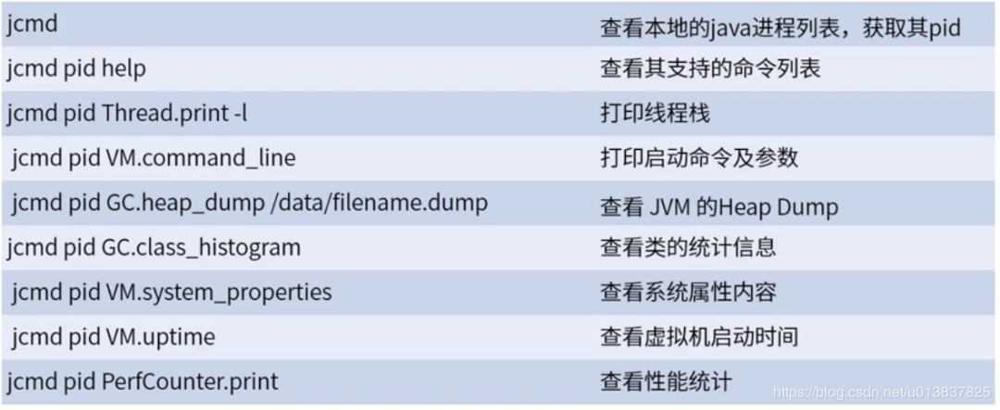
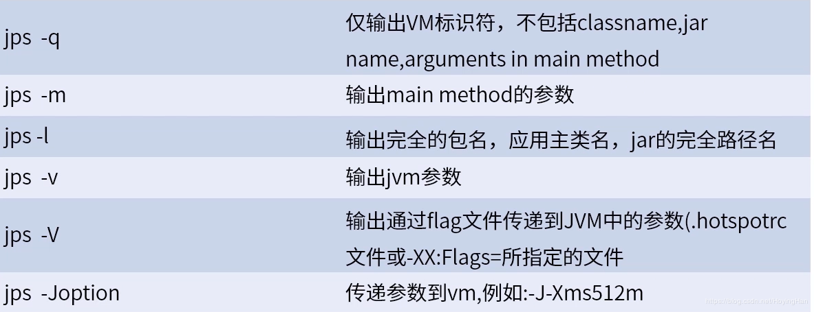
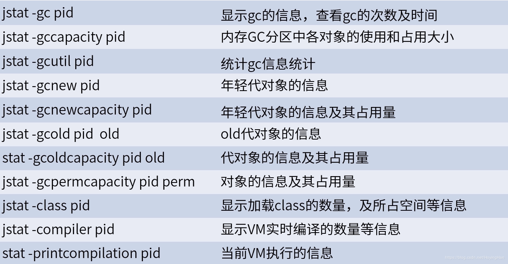
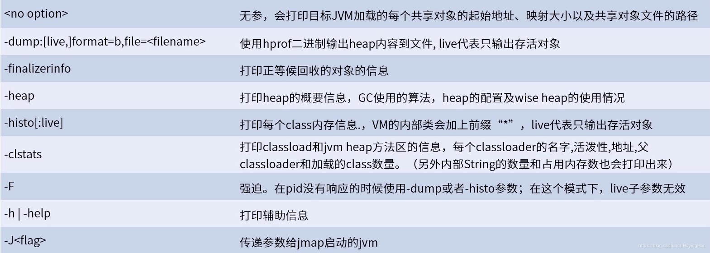

# 线上故障排查

## 1. 整体情况

- 服务器整体情况：<code>top</code> 查看服务器总体情况，同时可以使用<code>uptime</code>，查看精简版的信息。主要包括CPU，内存，IO等情况。
- CPU：<code>vmstat</code>，查看CPU的情况。
- 内存：<code>free</code>，查看内存使用情况，如果使用m为单位，可以填加参数<code>-m</code>，如<code>free -m</code>。
- 硬盘：<code>df</code>，查看硬盘使用情况。
- 磁盘IO：<code>iostat</code>
- 网络IO：<code>ifstat</code>

## 2. 线上服务器运行很慢排查原因

1. 先用<code>top</code>命令找出CPU占比最高的进程。
2. <code>ps -ef</code>或者<code>jps</code>查看进程编号。
3. 定位到具体的线程：<code>ps -mp进程 -o THREAD,tid，time</code>，-m显示所有的线程，-p pid进程使用cpu的时间，-o该参数后是用户自定义格式。
4. 将需要的线程ID转换为16进制格式（英文小写格式），<code>printf "%x\n"</code>有问题的线程ID
5. <code>jstack进程ID | grep（16进制线程ID小写英文） -A60</code>得到Java程序详细信息，定位到第几行。

## 3. Java自带工具

- Java官网推荐使用的命令：**jcmd**，**jconsole**，**jmc**，**jvisualvm**

- 其他命令如：**jps**，**jstat**，**jstatd**等在Java8的文档中都已经不推荐使用了。官网的原话是：

  ```markdown
  You can use the following tools to monitor JVM performance statistics. The tools described in this section are unsupported and experimental, and should be used with that in mind. They may not be available in future JDK versions.
  ```

  ### 常用命令用法

1. <code>jcmd</code>：JVM诊断命令工具-将诊断命令请求发送到正在运行的Java虚拟机，可以查看 JVM 信息。

   ```shell
   jcmd [-l|-h|-help]
   ```

   ```shell
   jcmd pid | main-class PerfCounter.print
   jcmd pid | main-class -f filename
   jcmd pid | main-class command[ arguments]
   ```
   

2. `jconsole`：一个兼容jmx的图形化工具，用于监视Java虚拟机。它可以监视本地和远程jvm。它还可以监视和管理应用程序。具体使用方式可以参考官网：[Monitoring and Management for the Java Platform](https://docs.oracle.com/javase/8/docs/technotes/guides/management/index.html)

3. `jmc`：Java任务控制(JMC)客户端。包括用于监视和管理Java应用程序的工具，而不会引入通常与这些类型的工具相关的性能开销。这个工具性能更好。

4. `jvisualvm`：一个图形化工具，提供了Java技术应用程序(Java应用程序)在Java虚拟机中运行时的详细信息。Java VisualVM提供内存和CPU分析、堆转储分析、内存泄漏检测、对mbean的访问和垃圾收集。具体可以参考官方文档：[Java VisualVM](https://docs.oracle.com/javase/8/docs/technotes/guides/visualvm/index.html)

5. `jps(java process status)`：显示所有Java进程(显示的是java启动的进程，并非操作系统的进程)。


6. `jinfo`：查看JVM的全部参数，也可以查看某个进程的详细信息。

7. `jstat`：监控虚拟机，在JVM性能优化时经常用到。

   ```shell
   e.g：
   jstat -gc -h10 pid 1000 #每1秒更新一次pid进程的gc情况
   ```
   

8. `jmap`：打印进程内存中对象的情况，在内存泄露或内存溢出时经常用到的命令。

   

9. `jstack`：打印指定Java进程或者远程调试服务的Java堆栈信息，在死锁或者CPU 100%时候去看JVM中运行的线程，如果是64位机器，则-J-d64。

   

11. `jhat`：分析Java堆。此命令是实验性的，不受支持。
